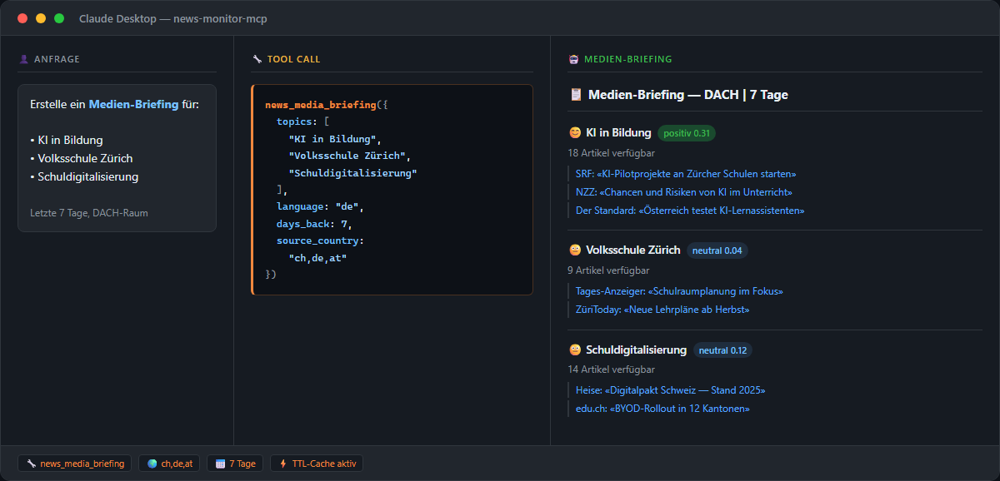

[🇬🇧 English Version](README.md)

> 🇨🇭 **Teil des [Swiss Public Data MCP Portfolios](https://github.com/malkreide)**

# 📰 news-monitor-mcp


[](https://opensource.org/licenses/MIT)
[](https://www.python.org/downloads/)
[](https://modelcontextprotocol.io/)
[](https://worldnewsapi.com/)


> MCP-Server für globales Nachrichten-Monitoring, Medienanalyse und Sentiment-Tracking via WorldNewsAPI — Volltextsuche in 150+ Ländern, Sentiment-Analyse auf Deutsch und Englisch, Top-Schlagzeilen, GL-Briefings, Zeitungscovers und Geo-Suche. API-Schlüssel erforderlich.

---

## Übersicht

**news-monitor-mcp** verwandelt jeden KI-Assistenten in einen proaktiven Medienintelligenz-Agenten. Der Server verbindet LLMs wie Claude mit globalen Nachrichtendaten: vom Reputationsmonitoring Schweizer Institutionen bis zu wöchentlichen GL-Briefings und Trenderkennung nach Kategorien.

**Quelle:** WorldNewsAPI (worldnewsapi.com) — die einzige frei zugängliche News-API mit deutschsprachiger Sentiment-Analyse.

**API-Schlüssel erforderlich.** Kostenloser Key unter [worldnewsapi.com/console](https://worldnewsapi.com/console/) (1'000 Calls/Monat im Free Tier).

**Anker-Demo-Abfrage:**
*«Wie wurde das Schulamt Zürich in den letzten 30 Tagen in den Medien dargestellt, und wie ist das Gesamt-Sentiment?»*

---

## Funktionen

- 🔍 **Volltextsuche** – 150+ Länder, 50+ Sprachen, Boolean-Abfragen und exakte Phrasensuche
- 📊 **Sentiment-Analyse** – nur Deutsch und Englisch (WorldNewsAPI-Alleinstellungsmerkmal); Werte von −1 (negativ) bis +1 (positiv)
- 📰 **Top-Schlagzeilen** – nach Land und Sprache geclustert, gereiht nach Anzahl berichtender Quellen
- 📋 **Medien-Briefing** – Multi-Themen-Wochenbericht mit Sentiment-Übersicht für GL- / Geschäftsleitungs-Updates
- 🗞️ **Zeitungscovers** – digitale Titelseiten von 6'000+ Publikationen in 125 Ländern
- 📡 **Trend-Radar** – kategoriebasierte Trenderkennung (Politik, Technologie, Bildung, …) pro Land
- 📍 **Geo-Suche** – standortspezifische Nachrichten (Zürich, Bern, Basel, Kanton Zürich, …)
- ☁️ **Dual Transport** – stdio für Claude Desktop, Streamable HTTP für Cloud-Deployment

| # | Tool | Beschreibung |
|---|---|---|
| 1 | `news_search` | Volltextsuche in 150+ Ländern |
| 2 | `news_top_headlines` | Top-Schlagzeilen nach Land und Sprache |
| 3 | `news_sentiment_monitor` | Sentiment-Analyse für Entität oder Thema |
| 4 | `news_media_briefing` | Multi-Themen-Wochenbericht |
| 5 | `news_retrieve_article` | Vollständigen Artikel per ID abrufen |
| 6 | `news_search_sources` | Nachrichtenquellen nach Name/Land suchen |
| 7 | `news_front_pages` | Digitale Zeitungscovers |
| 8 | `news_trend_radar` | Kategorie-basierte Trenderkennung pro Land |
| 9 | `news_geo_search` | Standortspezifische Nachrichtensuche |

---

## Demo



> *"Erstelle ein Medien-Briefing für: KI in Bildung, Volksschule Zürich, Schuldigitalisierung"*

---

## Datenquellen

| Quelle | API-Typ | Inhalt |
|---|---|---|
| **WorldNewsAPI** | REST JSON | 150+ Länder, 50+ Sprachen, Volltext, Sentiment |

---

## Voraussetzungen

- Python 3.11+
- `uv` oder `pip`
- API-Schlüssel von [worldnewsapi.com/console](https://worldnewsapi.com/console/) (Free Tier verfügbar)

---

## Installation

```bash
# Empfohlen: uvx (kein Installationsschritt nötig)
uvx news-monitor-mcp

# Alternativ: pip
pip install news-monitor-mcp
```

---

## Schnellstart

```bash
# Server starten (stdio-Modus für Claude Desktop)
WORLD_NEWS_API_KEY=dein-key uvx news-monitor-mcp
```

Sofort in Claude Desktop ausprobieren:
> *«Zeig mir die Top-Nachrichten aus der Schweiz heute»*
> *«Wie wird das Schulamt Zürich in deutschsprachigen Medien diesen Monat dargestellt?»*
> *«Erstelle ein Medien-Briefing zu: Volksschule Zürich, KI in der Bildung, Schuldigitalisierung»*

---

## Konfiguration

### Umgebungsvariablen

| Umgebungsvariable | Standard | Beschreibung |
|---|---|---|
| `WORLD_NEWS_API_KEY` | – | **Erforderlich.** API-Schlüssel von worldnewsapi.com |
| `MCP_TRANSPORT` | `stdio` | Transport: `stdio` oder `streamable_http` |
| `MCP_PORT` | `8000` | Port für HTTP-Transport |

### Claude Desktop Konfiguration

```json
{
  "mcpServers": {
    "news-monitor": {
      "command": "uvx",
      "args": ["news-monitor-mcp"],
      "env": {
        "WORLD_NEWS_API_KEY": "dein-api-key-hier"
      }
    }
  }
}
```

**Pfad zur Konfigurationsdatei:**
- macOS: `~/Library/Application Support/Claude/claude_desktop_config.json`
- Windows: `%APPDATA%\Claude\claude_desktop_config.json`

Nach Neustart von Claude Desktop stehen alle Tools zur Verfügung. Beispielfragen:
- «Zeig mir die Top-Schweizer-Nachrichten heute»
- «Wie ist das Medien-Sentiment zu KI in der Bildung diesen Monat?»
- «Erstelle ein Wochen-Briefing für: Schulamt Zürich, Volksschule, KI Bildung»
- «Alle deutschsprachigen Artikel zur Schuldigitalisierung der letzten 14 Tage»
- «Zeig mir die Titelseiten Schweizer Zeitungen heute»

### Cloud-Deployment (Streamable HTTP)

Für den Einsatz via **claude.ai im Browser** (z. B. auf verwalteten Arbeitsplätzen ohne lokale Software-Installation):

**Render.com (empfohlen):**
1. Repository auf GitHub pushen/forken
2. Auf [render.com](https://render.com): New Web Service → GitHub-Repo verbinden
3. `WORLD_NEWS_API_KEY` in den Render-Umgebungsvariablen setzen
4. In claude.ai unter Settings → MCP Servers eintragen: `https://your-app.onrender.com/mcp`

```bash
# Docker / lokaler HTTP-Modus
WORLD_NEWS_API_KEY=dein-key MCP_TRANSPORT=streamable_http MCP_PORT=8000 python -m news_monitor_mcp.server
```

---

## Architektur

```
┌─────────────────┐    ┌──────────────────────────┐    ┌──────────────────────────┐
│  Claude / KI    │────▶│   News Monitor MCP        │────▶│   WorldNewsAPI           │
│  (MCP Host)     │◀────│   (MCP Server)            │◀────│   REST JSON API          │
└─────────────────┘    │                            │    │   150+ Länder            │
                       │  9 Tools                   │    │   50+ Sprachen           │
                       │  Stdio | Streamable HTTP   │    │   Sentiment DE/EN        │
                       └──────────────────────────┘    └──────────────────────────┘
```

---

## Projektstruktur

```
news-monitor-mcp/
├── src/
│   └── news_monitor_mcp/
│       ├── __init__.py
│       └── server.py          # Alle 9 Tools
├── tests/
│   ├── __init__.py
│   └── test_server.py         # 20 Tests (Unit + Live)
├── pyproject.toml
├── CHANGELOG.md
├── CONTRIBUTING.md
├── LICENSE
├── README.md                  # Englische Hauptversion
└── README.de.md               # Diese Datei (Deutsch)
```

---

## Tests

```bash
# Unit-Tests (kein API-Key erforderlich)
PYTHONPATH=src pytest tests/ -m "not live"

# Integrationstests (Live-API-Aufrufe, API-Key erforderlich)
PYTHONPATH=src pytest tests/ -m "live"
```

---

## Anwendungsbeispiele

### Schulamt / Institutionskommunikation
```
«Wie wurde das Schulamt Zürich in den letzten 30 Tagen in den Medien dargestellt?»
→ news_sentiment_monitor(entity="Schulamt Zürich", language="de", days_back=30)

«Erstelle ein wöchentliches Medien-Briefing für die Geschäftsleitung»
→ news_media_briefing(topics=["Volksschule Zürich", "KI Bildung", "Schuldigitalisierung"])

«Was berichten Schweizer Medien zur Schuldigitalisierung?»
→ news_search(query="Schuldigitalisierung", language="de", source_country="ch")
```

### KI-Fachgruppe
```
«Was sind die aktuellen Tech-Trends in der Schweizer Presse diese Woche?»
→ news_trend_radar(category="technology", source_country="ch", language="de")

«Wie wird KI-Entwicklung in der Bildung international berichtet?»
→ news_search(query="AI education classroom", language="en", number=20)

«Vergleich Schweizer und deutscher Medien zur KI-Regulierung»
→ news_search(query="KI Regulierung", source_country="ch", language="de")
→ news_search(query="KI Regulierung", source_country="de", language="de")
```

### Stadtverwaltung / Standortrecherche
```
«Was wird über die Schulinfrastruktur in Zürich berichtet?»
→ news_geo_search(location="Zürich", query="Schule")

«Zeig die heutigen Titelseiten Schweizer Zeitungen»
→ news_front_pages(source_country="ch")
```

→ [Weitere Anwendungsbeispiele nach Zielgruppe](EXAMPLES.md) →

---

## Sentiment-Analyse

WorldNewsAPI bietet deutschsprachige Sentiment-Analyse — ein Alleinstellungsmerkmal unter News-APIs:

| Score | Label | Bedeutung |
|---|---|---|
| > 0,3 | positiv 😊 | Positive Berichterstattung |
| −0,3 bis 0,3 | neutral 😐 | Neutrale / sachliche Berichterstattung |
| < −0,3 | negativ 😟 | Kritische / negative Berichterstattung |

⚠️ **Sentiment ist nur für Deutsch (`de`) und Englisch (`en`) verfügbar.**

---

## Sicherheit, Grenzen & verantwortungsvoller Einsatz

### Nur-Lese-Betrieb
12 der 15 Tools tragen `readOnlyHint: true`. Alle 9 Monitoring-Tools (Suche,
Headlines, Sentiment, Briefing, Artikel, Quellen, Titelseiten, Trends, Geo)
sind vollständig schreibgeschützt und senden nur GET-Anfragen an die WorldNewsAPI.
Die 3 Ausnahmen sind lokale Operationen: `news_alert_create` und `news_alert_delete`
(schreiben/löschen `~/.news-monitor-mcp/alerts.json`) und `news_cache_clear`
(leert den In-Memory-Cache). Keines der 15 Tools verändert externe Datenquellen.

### API-Rate-Limits

| Einschränkung | WorldNewsAPI Free Tier | Kostenpflichtige Pläne |
|---|---|---|
| Calls/Monat | 1'000 | Bis 1M |
| Artikel/Call | 10 | Bis 100 |
| Historische Tiefe | 30 Tage | Erweitert |
| Timeout pro Call | 30 Sekunden | 30 Sekunden |

Der TTL-Cache (v0.2+) reduziert redundante API-Calls um bis zu 80%.

### Datenschutz

- **Keine personenbezogenen Daten gespeichert:** Der Server speichert keine persistenten Nutzerdaten. Cache-Einträge liegen im Arbeitsspeicher und werden beim Serverneustart zurückgesetzt.
- **Kein Profiling:** Der Server ruft ausschliesslich öffentlich erschienene Nachrichtenartikel ab. Er ist nicht für die Überwachung oder das Profiling von Personen konzipiert.
- **Alert-Daten:** Alert-Konfigurationen werden lokal in `~/.news-monitor-mcp/alerts.json` gespeichert — ausschliesslich auf dem eigenen Gerät, niemals übertragen.

### Verantwortungsvoller Einsatz

- Nur öffentliche Nachrichten abfragen — nicht als Profiling-Tool für Einzelpersonen einsetzen.
- Sentiment-Scores spiegeln die algorithmische Analyse des journalistischen Tons wider, keine verifizierten redaktionellen Urteile.
- Ergebnisse hängen von der Indexierung durch WorldNewsAPI ab; Schweizer Regionalmedien sind möglicherweise weniger gut abgedeckt als nationale Titel.

### Nutzungsbedingungen

Nutzerinnen und Nutzer müssen folgende Bedingungen einhalten:
- [WorldNewsAPI Nutzungsbedingungen](https://worldnewsapi.com/terms-of-service/)
- [WorldNewsAPI Datenschutzerklärung](https://worldnewsapi.com/privacy-policy/)

Dieser MCP-Server ist ein unabhängiges Open-Source-Projekt und steht in keiner Verbindung mit WorldNewsAPI.

---

## Synergie mit anderen MCP-Servern

`news-monitor-mcp` lässt sich mit anderen Servern des Portfolios kombinieren:

| Kombination | Anwendungsfall |
|---|---|
| `+ fedlex-mcp` | Recht trifft Diskurs: Rechtsgrundlagen + Medienberichterstattung |
| `+ global-education-mcp` | OECD-Statistiken + aktueller Medienkontext |
| `+ srgssr-mcp` | Schweizer Öffentlichkeitsmedien + internationaler Nachrichtenvergleich |
| `+ swiss-environment-mcp` | Umweltdaten + Medienberichterstattung |
| `+ swiss-statistics-mcp` | BFS-Statistiken + aktuelles Mediennarrativ |
| `+ zurich-opendata-mcp` | Stadtdaten + lokale Medienberichterstattung |

---

## Changelog

Siehe [CHANGELOG.md](CHANGELOG.md)

---

## Lizenz

MIT-Lizenz – siehe [LICENSE](LICENSE)

---

## Autor

Hayal Oezkan · [malkreide](https://github.com/malkreide)

---

## Credits & Verwandte Projekte

- **Daten:** [WorldNewsAPI](https://worldnewsapi.com/) – globale Nachrichtendaten mit Sentiment-Analyse
- **Protokoll:** [Model Context Protocol](https://modelcontextprotocol.io/) – Anthropic / Linux Foundation
- **Verwandt:** [swiss-culture-mcp](https://github.com/malkreide/swiss-culture-mcp) – MCP-Server für Schweizer Kulturdaten
- **Verwandt:** [srgssr-mcp](https://github.com/malkreide/srgssr-mcp) – MCP-Server für SRG SSR Schweizer Öffentlichkeitsmedien
- **Portfolio:** [Swiss Public Data MCP Portfolio](https://github.com/malkreide)
