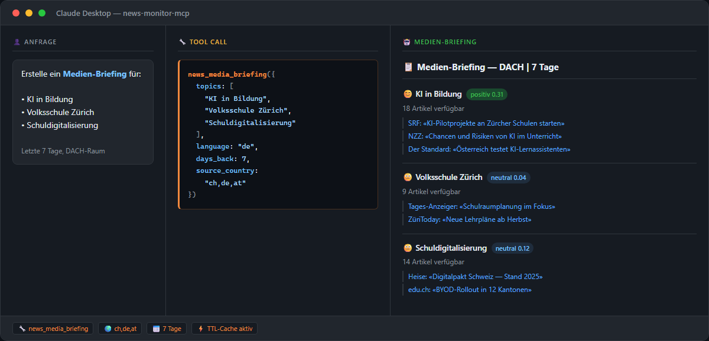

> 🇨🇭 **Part of the [Swiss Public Data MCP Portfolio](https://github.com/malkreide)**

# 📰 news-monitor-mcp


[](https://opensource.org/licenses/MIT)
[](https://www.python.org/downloads/)
[](https://modelcontextprotocol.io/)
[](https://worldnewsapi.com/)


> MCP server for global news monitoring, media analysis and sentiment tracking via WorldNewsAPI — full-text search across 150+ countries, German/English sentiment analysis, top headlines, GL briefings, newspaper front pages and geo-search. API key required.

[🇩🇪 Deutsche Version](README.de.md)

---

## Overview

**news-monitor-mcp** transforms any AI assistant into a proactive media intelligence agent. The server connects LLMs like Claude with global news data: from Swiss institutional reputation monitoring to weekly leadership briefings and trend detection across categories.

**Source:** WorldNewsAPI (worldnewsapi.com) — the only freely available news API with German-language sentiment analysis.

**API key required.** Get a free key at [worldnewsapi.com/console](https://worldnewsapi.com/console/) — free plan: 50 points/day, no credit card, backlink to worldnewsapi.com required (checked 2026-08-14).

**Anchor demo query:**
*"How has the Schulamt Zürich been portrayed in the media over the last 30 days, and what is the overall sentiment?"*

---

## Features

- 🔍 **Full-text search** – 150+ countries, 50+ languages, Boolean queries and exact phrase matching
- 📊 **Sentiment analysis** – German and English only (WorldNewsAPI unique feature); scores from −1 (negative) to +1 (positive)
- 📰 **Top headlines** – clustered by country and language, ranked by number of sources reporting
- 📋 **Media briefing** – multi-topic weekly report with sentiment overview for GL / leadership updates
- 🗞️ **Newspaper front pages** – digital covers from 6,000+ publications in 125 countries
- 📡 **Trend radar** – category-based trend detection (politics, technology, education, …) per country
- 📍 **Geo-search** – location-specific news (Zürich, Bern, Basel, Kanton Zürich, …)
- ☁️ **Dual transport** – stdio for Claude Desktop, Streamable HTTP for cloud deployment

| # | Tool | Description |
|---|---|---|
| 1 | `news_search` | Full-text news search in 150+ countries |
| 2 | `news_top_headlines` | Top headlines by country and language |
| 3 | `news_sentiment_monitor` | Sentiment analysis for entity or topic |
| 4 | `news_media_briefing` | Multi-topic weekly briefing report |
| 5 | `news_retrieve_article` | Fetch full article by ID |
| 6 | `news_search_sources` | Find available news sources by name/country |
| 7 | `news_front_pages` | Digital newspaper front pages |
| 8 | `news_trend_radar` | Category-based trend detection per country |
| 9 | `news_geo_search` | Location-specific news search |
| 10 | `news_alert_create` | Create a persistent alert (sentiment / volume / keyword) |
| 11 | `news_alert_list` | List configured alerts with status |
| 12 | `news_alert_check` | Evaluate alerts against current data |
| 13 | `news_alert_delete` | Permanently remove an alert |
| 14 | `news_cache_stats` | Cache hit-rate and entries by type |
| 15 | `news_cache_clear` | Clear cache (entirely or per tool type) |

---

## Demo



> *"Create a media briefing for: AI in education, Volksschule Zürich, school digitalisation"*

---

## Data Sources

| Source | API Type | Content |
|---|---|---|
| **WorldNewsAPI** | REST JSON | 150+ countries, 50+ languages, full text, sentiment |

---

## Prerequisites

- Python 3.11+
- `uv` or `pip`
- API key from [worldnewsapi.com/console](https://worldnewsapi.com/console/) (free tier available)

---

## Installation

```bash
# Recommended: uvx (no install step needed)
uvx news-monitor-mcp

# Alternative: pip
pip install news-monitor-mcp
```

---

## Quickstart

```bash
# Start the server (stdio mode for Claude Desktop)
WORLD_NEWS_API_KEY=your-key uvx news-monitor-mcp
```

Try it immediately in Claude Desktop:
> *"Show me the top news from Switzerland today"*
> *"How is the Schulamt Zürich covered in German-language media this month?"*
> *"Create a media briefing on: Volksschule Zürich, AI in education, school digitalisation"*

---

## Configuration

### Environment Variables

| Variable | Default | Description |
|---|---|---|
| `WORLD_NEWS_API_KEY` | – | **Required.** API key from worldnewsapi.com |
| `MCP_TRANSPORT` | `stdio` | Transport: `stdio` or `streamable_http` |
| `MCP_HOST` | `127.0.0.1` | HTTP bind host. Use `0.0.0.0` only inside a container. |
| `MCP_PORT` | `8000` | Port for HTTP transport |
| `MCP_BEARER_TOKEN` | – | **Required in `--http` mode.** Bearer token clients must present in `Authorization: Bearer <token>`. Generate via `python -c "import secrets; print(secrets.token_urlsafe(32))"`. |
| `MCP_ALLOWED_ORIGINS` | – | Optional CSV allowlist for the `Origin` header (DNS-rebinding protection). Example: `https://claude.ai`. |
| `LOG_LEVEL` | `INFO` | Log level: `DEBUG` / `INFO` / `WARNING` / `ERROR`. Logs are emitted as JSON to stderr with automatic redaction of `api-key=` query params and `Authorization: Bearer` headers. |
| `NEWS_MONITOR_ALERTS_DIR` | `~/.news-monitor-mcp` | Directory that holds `alerts.json`. The parent dir must not be a symlink (refused at startup as a defense against path-injection). File is created with mode `0o600`, directory with `0o700`. |
| `NEWS_MONITOR_ALERTS_FILE` | – | *(Back-compat)* explicit path to the alerts file. Same symlink check applies. Prefer `NEWS_MONITOR_ALERTS_DIR`. |
| `MCP_ALERT_RETENTION_DAYS` | `90` | Alerts older than this many days are deleted on server start (Privacy default per [`docs/privacy-dsg.md`](docs/privacy-dsg.md)). Set to `0` to disable retention. |
| `MCP_CACHE_MAX_PER_TYPE` | `1000` | Maximum cache entries per tool type. When exceeded, the least-recently-used entry of that type is evicted. Set to `0` to disable the cap (unbounded growth — only safe for short-lived processes). |
| `MCP_CACHE_SWEEP_SECONDS` | `300` | Interval for the background task that removes TTL-expired entries from the cache. Set to `0` to disable the sweep (expired entries are still pruned lazily on `news_cache_stats`). |

### Claude Desktop Configuration

```json
{
  "mcpServers": {
    "news-monitor": {
      "command": "uvx",
      "args": ["news-monitor-mcp"],
      "env": {
        "WORLD_NEWS_API_KEY": "your-api-key-here"
      }
    }
  }
}
```

**Config file locations:**
- macOS: `~/Library/Application Support/Claude/claude_desktop_config.json`
- Windows: `%APPDATA%\Claude\claude_desktop_config.json`

After restarting Claude Desktop, all tools are available. Example queries:
- "Show me the top Swiss news today"
- "What is the media sentiment on AI in education this month?"
- "Create a weekly briefing for: Schulamt Zürich, Volksschule, KI Bildung"
- "Find all German-language articles about school digitalisation in the last 14 days"
- "Show me the front pages of Swiss newspapers today"

### Cloud Deployment (Streamable HTTP)

For use via **claude.ai in the browser** (e.g. on managed workstations without local software):

**Authentication is mandatory.** The HTTP transport refuses any request without a valid `Authorization: Bearer <token>` header. Generate a token once and keep it secret:

```bash
python -c "import secrets; print(secrets.token_urlsafe(32))"
```

**Render.com (recommended):**
1. Push/fork the repository to GitHub
2. On [render.com](https://render.com): New Web Service → connect GitHub repo
3. Set the following environment variables in the Render dashboard:
   - `WORLD_NEWS_API_KEY` — your WorldNewsAPI key
   - `MCP_BEARER_TOKEN` — the token generated above
   - `MCP_HOST=0.0.0.0` — bind on all interfaces inside the container
   - `MCP_ALLOWED_ORIGINS=https://claude.ai` *(optional, recommended)*
4. In claude.ai under Settings → MCP Servers, add the URL `https://your-app.onrender.com/mcp` and configure the Bearer token as the auth header.

```bash
# Local HTTP mode (binds 127.0.0.1 by default)
WORLD_NEWS_API_KEY=your-key \
  MCP_BEARER_TOKEN=$(python -c "import secrets; print(secrets.token_urlsafe(32))") \
  news-monitor-mcp --http --port 8000

# Verify auth is enforced
curl -i http://127.0.0.1:8000/mcp                                  # → 401
curl -i -H "Authorization: Bearer $MCP_BEARER_TOKEN" http://127.0.0.1:8000/mcp
```

### Scaling notes

This server is currently **single-process / single-replica**:

- The TTL cache lives in process memory (`NewsCache`). If you run multiple Render or Kubernetes replicas, each replica has its **own** cache — hit-rates drop linearly with the replica count.
- Alerts persist to a local `alerts.json` (defaults to `/data` inside the container). Multiple replicas mounting the **same** persistent volume serialize via `fcntl.flock`, but for true cluster operation a shared store (Redis / Postgres) is needed — see the open finding [`SCALE-STATEFUL`](audits/2026-05-13-news-monitor-mcp/findings/SCALE-stateful-singletons.md).
- On **Render Free Tier**, the container sleeps after ~15 minutes of inactivity and loses non-persistent state. Attach a Persistent Disk for `/data` if you need alerts to survive restarts. For Render Free + alerts you must accept that the cache is lost on every wake-up.

The `MCP_CACHE_MAX_PER_TYPE` cap (default `1000` entries / type) and the background sweep (`MCP_CACHE_SWEEP_SECONDS`, default 5 min) prevent the in-process cache from growing without bound.

### Container image

A non-root multi-stage `Dockerfile` is included and built on every CI run. Inside the container the server defaults to `--http`, binds `0.0.0.0:8000`, persists alerts under `/data`, and refuses to start if `MCP_BEARER_TOKEN` is missing.

```bash
docker build -t news-monitor-mcp .

docker run --rm -p 8000:8000 \
  -e WORLD_NEWS_API_KEY=your-key \
  -e MCP_BEARER_TOKEN=$(python -c "import secrets; print(secrets.token_urlsafe(32))") \
  -e MCP_ALLOWED_ORIGINS=https://claude.ai \
  -v news-monitor-data:/data \
  news-monitor-mcp
```

---

## Architecture

```
┌─────────────────┐    ┌──────────────────────────┐    ┌──────────────────────────┐
│  Claude / AI    │────▶│   News Monitor MCP        │────▶│   WorldNewsAPI           │
│  (MCP Host)     │◀────│   (MCP Server)            │◀────│   REST JSON API          │
└─────────────────┘    │                            │    │   150+ countries         │
                       │  9 Tools                   │    │   50+ languages          │
                       │  Stdio | Streamable HTTP   │    │   Sentiment DE/EN        │
                       └──────────────────────────┘    └──────────────────────────┘
```

---

## Project Structure

```
news-monitor-mcp/
├── src/
│   └── news_monitor_mcp/
│       ├── __init__.py
│       └── server.py          # All 9 tools
├── tests/
│   ├── __init__.py
│   └── test_server.py         # 20 tests (unit + live)
├── pyproject.toml
├── CHANGELOG.md
├── CONTRIBUTING.md
├── LICENSE
├── README.md                  # This file (English)
└── README.de.md               # German version
```

---

## Testing

```bash
# Unit + contract tests (no network) — this is what CI runs
PYTHONPATH=src pytest tests/ -m "not live"

# Live tests. The route check needs no key; the data tests skip without one.
PYTHONPATH=src pytest tests/ -m "live"

# Re-record the route inventory (writes tests/fixtures/ + PROVENANCE.md)
PYTHONPATH=src python scripts/record_fixtures.py
```

**149 tests** — 144 offline, 5 live (2 of which need no API key).

The live tests run daily at 06:17 UTC via
[`.github/workflows/live-tests.yml`](.github/workflows/live-tests.yml), not on
push: they measure the source, which changes independently of this repo.

### Three live tests never ran

Until 2026-08-08 the repo's three live tests carried `@pytest.mark.live` but no
`@pytest.mark.asyncio`. Under pytest-asyncio's strict default that does not mean
"skipped" — it means `async def functions are not natively supported`. They
never executed, and anyone running `-m live` got three errors that said nothing
about the source. CI excludes `-m live`, so nothing reported it.

`asyncio_mode = "auto"` now makes a forgotten marker unable to cause this.

And running would not have shown much either:

```python
assert "Volksschule" in result or "Ergebnisse" in result
```

The second branch matches the tool's own results heading, so the disjunction
could not fail. `assert "Top-Schlagzeilen" in result` and `assert "Sentiment" in
result` likewise matched only the template. All three now assert something that
can fail, and they **skip** rather than fail when no key is set — "red" should
mean something is wrong, not that you have no key.

### What is verified without a key, and what is not

`tests/fixtures/api_routen.json` records, for each of the five paths the tools
build, the status code and content type measured without a key. The gateway
routes **before** authenticating:

| Path | Response |
|---|---|
| the five paths the server builds | 401, `application/json` |
| a freely invented path (control) | 404, `text/html` |

So a 401 means "this route exists". Without the control it would only mean "I
got a 401" — and that is not a given: `epl.bag.admin.ch` elsewhere in this
portfolio answers 401 for invented paths too. The recorder therefore re-measures
the control on every run and aborts if it stops discriminating.

**Still open, and marked as such in `PROVENANCE.md`:** whether the query
parameter names the server sends are correct. The API answers 401 regardless of
parameters, so no key means no verification. In `global-education-mcp` in this
same portfolio exactly that went wrong — two filters were silently inert
because unknown parameters were answered with HTTP 200 and dropped. That check
is outstanding, not done.

### Empty result vs. changed response shape

`data.get("news", [])` answers two entirely different cases the same way: "the
source found nothing" and "the source answers differently than we assume". The
second becomes "0 results" — complete, plausible, formatted and wrong. That is
not hypothetical: in `global-education-mcp` the envelope had been renamed, so
**every** answer came back empty while 128 tests stayed green.

`articles_of()` now reads the envelope. An empty `news` stays an empty list — a
statement by the source. A *missing* `news` is not a statement about the news
but about the response, and is reported as such.

---

## Example Use Cases

### Schulamt / Institutional Communication
```
"How has the Schulamt Zürich been portrayed in media over the last 30 days?"
→ news_sentiment_monitor(entity="Schulamt Zürich", language="de", days_back=30)

"Create a weekly media briefing for leadership"
→ news_media_briefing(topics=["Volksschule Zürich", "KI Bildung", "Schuldigitalisierung"])

"What are Swiss media reporting on school digitalisation?"
→ news_search(query="Schuldigitalisierung", language="de", source_country="ch")
```

### KI-Fachgruppe / AI Working Group
```
"What are the current tech trends in Swiss press this week?"
→ news_trend_radar(category="technology", source_country="ch", language="de")

"How are AI developments in education covered internationally?"
→ news_search(query="AI education classroom", language="en", number=20)

"Compare Swiss and German media coverage of AI regulation"
→ news_search(query="KI Regulierung", source_country="ch", language="de")
→ news_search(query="KI Regulierung", source_country="de", language="de")
```

### City Administration / Location Research
```
"What is being reported about Zürich school infrastructure?"
→ news_geo_search(location="Zürich", query="Schule")

"Show today's front pages of Swiss newspapers"
→ news_front_pages(source_country="ch")
```

→ [More use cases by audience](EXAMPLES.md) →

---

## Sentiment Analysis

WorldNewsAPI offers German-language sentiment analysis — rare among news APIs:

| Score | Label | Meaning |
|---|---|---|
| > 0.3 | positiv 😊 | Positive coverage |
| −0.3 to 0.3 | neutral 😐 | Neutral / factual coverage |
| < −0.3 | negativ 😟 | Critical / negative coverage |

⚠️ **Sentiment is only available for German (`de`) and English (`en`).**

---

## Safety, Limits & Responsible Use

### Read-Only Operation
12 of the 15 tools carry `readOnlyHint: true`. All 9 monitoring tools (search,
headlines, sentiment, briefing, article, sources, front_pages, trend, geo) are
fully read-only and issue GET requests to WorldNewsAPI only. The 3 exceptions
are local-only operations: `news_alert_create` and `news_alert_delete` (write/
delete `~/.news-monitor-mcp/alerts.json`) and `news_cache_clear` (clears
in-memory cache). None of the 15 tools modify any external data source.

### API Rate Limits

| Constraint | WorldNewsAPI Free Tier | Paid Plans |
|---|---|---|
| Quota | 50 points/day | 500 – 50,000 points/day |
| Articles/call | 10 | Up to 100 |
| Historical depth | 30 days | Extended |
| Timeout per call | 30 seconds | 30 seconds |

Quotas checked against [worldnewsapi.com/pricing](https://worldnewsapi.com/pricing/)
on **2026-08-14**. Undated, a quota is indistinguishable from a guess after a
year. Two caveats worth knowing before you plan around this table:

- The API bills in **points, not calls.** What a request costs depends on the
  endpoint and its options, so there is no fixed "calls per day" figure — the
  earlier claim of 1,000 calls/month was both the wrong unit and the wrong
  magnitude.
- The articles-per-call split is **not stated per plan** in the public docs,
  which only give `number` ≤ 100 per request. The value of 10 for the free
  plan is inherited from earlier versions of this README and unverified.

The TTL cache (v0.2+) reduces redundant calls by up to 80%.

### Data Privacy

- **No personal data stored:** The server holds no persistent user data. Cache entries are in-memory and reset on server restart.
- **No profiling:** The server retrieves publicly published journalism only. It is not designed for surveillance or personal profiling.
- **Alert data:** Alert configurations are stored locally in `~/.news-monitor-mcp/alerts.json` — on your machine only, never transmitted.

### Responsible Use

- Query public news only — do not use as a profiling tool for individuals.
- Sentiment scores reflect algorithmic analysis of journalistic tone, not verified editorial judgements.
- Results depend on WorldNewsAPI's indexing; Swiss regional media may be less well-covered than national outlets.

### Terms of Service

Users must comply with:
- [WorldNewsAPI Terms of Service](https://worldnewsapi.com/terms-of-service/)
- [WorldNewsAPI Privacy Policy](https://worldnewsapi.com/privacy-policy/)

This MCP server is an independent open-source project and is not affiliated with WorldNewsAPI.

---

## Synergies with Other MCP Servers

`news-monitor-mcp` can be combined with other servers in the portfolio:

| Combination | Use Case |
|---|---|
| `+ fedlex-mcp` | Law meets discourse: legal framework + media coverage |
| `+ global-education-mcp` | OECD stats + current media context |
| `+ srgssr-mcp` | Swiss public media + international news comparison |
| `+ swiss-environment-mcp` | Environmental data + media reporting |
| `+ swiss-statistics-mcp` | BFS statistics + current media narrative |
| `+ zurich-opendata-mcp` | City data + local media coverage |

---

## Changelog

See [CHANGELOG.md](CHANGELOG.md)

---

## Contributing

See [CONTRIBUTING.md](CONTRIBUTING.md) ([Deutsch](CONTRIBUTING.de.md)).

---

## Security & Compliance

- Report vulnerabilities privately: see [SECURITY.md](SECURITY.md)
- Swiss public-sector deployment: see [`docs/isds-klassifikation.md`](docs/isds-klassifikation.md) for the ISDS / Schutzbedarfsfeststellung
- Swiss data protection (revDSG) — duties, profiling, retention, drittlandtransfer: [`docs/privacy-dsg.md`](docs/privacy-dsg.md)
- Audit history: [`audits/`](audits/)

---

## License

MIT License — see [LICENSE](LICENSE)

---

## Author

Hayal Oezkan · [malkreide](https://github.com/malkreide)

---

## Credits & Related Projects

- **Data:** [WorldNewsAPI](https://worldnewsapi.com/) – global news data with sentiment analysis
- **Protocol:** [Model Context Protocol](https://modelcontextprotocol.io/) – Anthropic / Linux Foundation
- **Related:** [swiss-culture-mcp](https://github.com/malkreide/swiss-culture-mcp) – MCP server for Swiss cultural heritage data
- **Related:** [srgssr-mcp](https://github.com/malkreide/srgssr-mcp) – MCP server for SRG SSR Swiss public media
- **Portfolio:** [Swiss Public Data MCP Portfolio](https://github.com/malkreide)

<!-- mcp-name: io.github.malkreide/news-monitor-mcp -->

<!-- BEGIN GENERATED: install -->
## Installation

Run via [`uv`](https://docs.astral.sh/uv/)'s `uvx` — no clone or manual install needed. Add to your MCP client config (`mcpServers` for Claude Desktop, Cursor and Windsurf; use a top-level `servers` key for VS Code in `.vscode/mcp.json`):

```json
{
  "mcpServers": {
    "news-monitor-mcp": {
      "command": "uvx",
      "args": [
        "news-monitor-mcp"
      ]
    }
  }
}
```
<!-- END GENERATED: install -->
